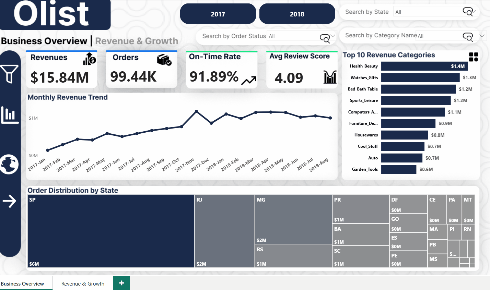
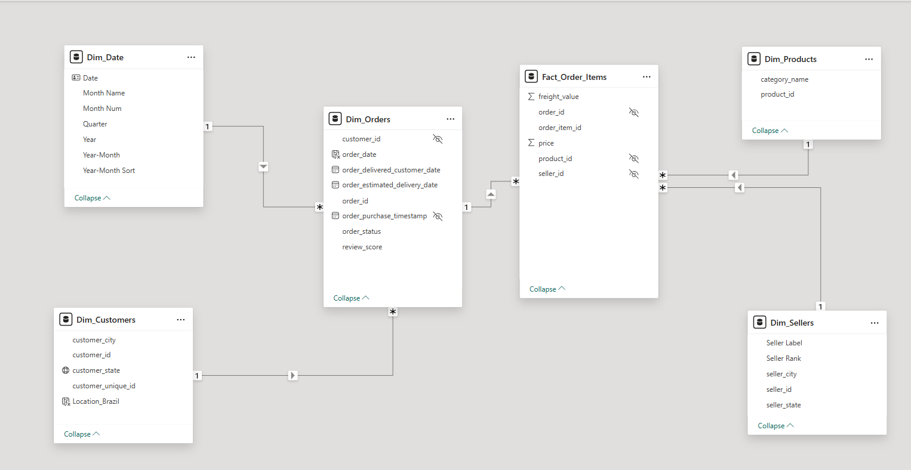

# Olist Brazilian E-Commerce Analysis



---

## What This Project Is

Olist is a real Brazilian e-commerce platform. This dataset covers **99,441 orders placed between 2016 and 2018** — with everything attached: payments, reviews, delivery timestamps, seller info, product categories, and customer locations across all Brazilian states.

The goal wasn't to build a pretty dashboard. The goal was to answer real business questions from the data up — and let the numbers tell the story.

**SQL Server did the heavy lifting. Power BI just showed the results.**

---

## How the Analysis Was Built

Most BI projects jump straight to visualization. This one didn't.

Every step of the analysis — data exploration, cleaning decisions, business logic, and the final data model — was built and validated in SQL Server before Power BI was opened.

```
Raw CSVs (8 tables)
    ↓
SQL Server — imported and explored table by table (EDA/)
    ↓
Data quality issues identified and resolved in SQL
    ↓
Master View built — single flat dataset joining all 8 tables (Master_View.sql)
    ↓
6 business questions answered directly in SQL
    ↓
Star schema designed and built as SQL Server views (Star_Schema_Views.sql)
    ↓
Power BI connected on top — visualization only
```

This approach means the analysis is fully reproducible without Power BI. Every finding in the dashboard can be traced back to a SQL query.

---

## The SQL Work

### Exploratory Data Analysis — 8 Tables

Before writing a single business query, each table was explored independently: row counts, null checks, duplicate detection, date range validation, distribution of key fields. The EDA folder has a separate file for each table.

Some things that came up:
- `order_reviews` had **547 orders with multiple review entries** — conflicting scores that would silently skew any satisfaction metric if left uncleaned
- `freight_value` had nulls that needed handling before any revenue calculation
- Category names were in Portuguese and required joining a translation table

### The Master View

All 8 tables were joined into a single flat view (`vw_Olist_Master_Data`) that all business queries run against. The review deduplication issue was fixed here using a window function — keeping only the most recent review per order:

```sql
WITH Clean_Review AS (
    SELECT order_id, review_score
    FROM (
        SELECT 
            order_id,
            review_score,
            ROW_NUMBER() OVER(
                PARTITION BY order_id 
                ORDER BY review_creation_date DESC
            ) AS Ranking
        FROM order_reviews
    ) AS RankedReviews
    WHERE Ranking = 1
)
```

### Star Schema — Built in SQL, Not in Power BI

The data model wasn't dragged together inside Power BI. Five views were written in SQL Server first:

| View | Type | Description |
|---|---|---|
| `vw_Fact_Order_Items` | Fact | Line-level transactions with price and freight |
| `vw_Dim_Orders` | Dimension | Order status, timestamps, review scores |
| `vw_Dim_Products` | Dimension | Product categories (translated to English) |
| `vw_Dim_Sellers` | Dimension | Seller IDs and locations |
| `vw_Dim_Customers` | Dimension | Customer state mapping |

Power BI imported these views directly. The model was already clean before it got there.

---

## Business Questions & Findings

### Is the business growing?

Yes — consistently. Revenue grew month over month from January 2017 through mid-2018, with one standout exception: **November 2017 produced the largest single-month spike in the entire dataset.** Black Friday demand was real and measurable.

### Which product categories drive the most revenue?

| Category | Revenue |
|---|---|
| Health & Beauty | $1.4M |
| Watches & Gifts | $1.3M |
| Bed, Bath & Table | $1.2M |
| Sports & Leisure | $1.2M |
| Computers & Accessories | $1.1M |

Five categories. That's where the money is. Everything else is a long tail.

### Where are the customers?

São Paulo alone accounts for **~41% of all orders and $5.77M in revenue**. The top 5 states (SP, RJ, MG, RS, PR) represent roughly 80% of total business. The other 22 states combined make up the remaining 20% — which is either a distribution problem or an untapped opportunity depending on how you look at it.

### How efficient is fulfillment?

- Average delivery time: **12.5 days**
- On-time rate: **91.89%** — over 9 in 10 orders arrived on or before the promised date

That's a solid operational baseline. But the next finding explains why delivery speed still matters a lot.

### Who are the top sellers?

3,095 active sellers. Average revenue per seller: **$5.12K**. Top seller: **$249K**.

That gap tells you everything — a small group of high-volume sellers drives the majority of revenue. The bottom of the seller pool is barely active.

### What actually drives customer satisfaction?

This was the most interesting finding in the project.

| Review Score | Avg Delivery Time |
|---|---|
| ⭐⭐⭐⭐⭐ 5 stars | 9.22 days |
| ⭐⭐⭐⭐ 4 stars | 10.52 days |
| ⭐⭐⭐ 3 stars | 11.88 days |
| ⭐⭐ 2 stars | 13.15 days |
| ⭐ 1 star | 16.42 days |

**7-day gap between a 1-star and a 5-star experience.** The pattern holds at every score level without exception. Delivery speed doesn't just correlate with satisfaction — it predicts it.

---

## Data Model



---

## Key Numbers

| Metric | Value |
|---|---|
| Total Revenue | $15.84M |
| Total Orders | 99,441 |
| Total Items Sold | 112,650 |
| Avg Delivery Time | 12.5 days |
| On-Time Rate | 91.89% |
| Avg Review Score | 4.09 / 5 |
| Active Sellers | 3,095 |

---

## Project Structure

```
📁 Olist-Brazilian-Ecommerce-Analysis
    📁 EDA/                       → One SQL file per source table. Null checks,
                                    distributions, duplicates, date ranges.
    📁 Analysis/
        Master_View.sql           → Joins all 8 tables. Handles review deduplication
                                    with ROW_NUMBER() window function.
        Star_Schema_Views.sql     → 5 SQL Server views that feed the Power BI model.
        Star_Schema.png           → Data model screenshot from Power BI.
    📁 Dashboard/
        Page1.png                 → Business Overview (revenue, categories, geography)
        Page2.png                 → Operations & Delivery Performance
        Olist_Dashboard.pbix      → Full Power BI file — download to interact
    README.md
```

---

## Tools

| Tool | What it did |
|---|---|
| SQL Server (SSMS) | EDA, data cleaning, business analysis, data modeling |
| T-SQL | CTEs, window functions, aggregations, view creation |
| Power BI Desktop | Connected to SQL views — visualization and dashboard only |
| DAX | KPI measures, time intelligence, MoM growth |
| Power Query | Minor transformations, seller label formatting |

---

**Saleh Hossam** — Data Analyst · Cairo, Egypt

[Portfolio](https://saleh-hossam.github.io) · [LinkedIn](https://www.linkedin.com/in/saleh-hossam) · [GitHub](https://github.com/Saleh-Hossam)
